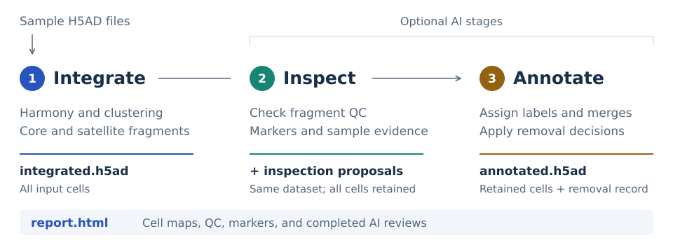

<p align="center">
  
</p>

<h1 align="center">MSP: Multi-Sample Pipeline</h1>

<p align="center">
  <strong>Review cell populations across samples and annotate them together.</strong>
</p>

<p align="center">
  <a href="pyproject.toml"></a>
  <a href="LICENSE"></a>
  <a href="https://github.com/chansigit/eca-rsi"></a>
</p>

<p align="center">
  <a href="#why-review-samples-together">Why MSP</a> &nbsp; · &nbsp;
  <a href="#how-it-works">Workflow</a> &nbsp; · &nbsp;
  <a href="#get-started">Get started</a> &nbsp; · &nbsp;
  <a href="#find-and-understand-your-results">Results</a> &nbsp; · &nbsp;
  <a href="#documentation">Documentation</a>
</p>

MSP integrates single-cell RNA-seq samples with Harmony, builds a shared cell
map, and produces a browser report. Optional AI agents inspect cluster quality
and assign cell types, with supporting genes and reasons for each decision.
Use it after sample-level analysis with [OSP](https://github.com/chansigit/osp),
or with your own compatible H5AD files.

## Why review samples together?

A population seen in one sample needs context: does it recur elsewhere, have
consistent markers, or separate mainly by quality? MSP brings sample composition,
marker expression, and QC evidence into the same analysis. It helps you review
suspicious groups and reconcile cell-type labels across samples.

## How it works

Integration builds the shared map. Inspection checks markers, quality, sample
composition, cluster geometry, and stability across clustering resolutions.
Annotation assigns broad and fine labels, merges groups judged to represent
the same population, and writes a filtered dataset. Both AI stages record
their evidence in the report.

<p align="center">
  <picture>
    <source media="(prefers-color-scheme: dark)" srcset="assets/msp-workflow-dark.svg">
    
  </picture>
</p>

## Get started

### 1. Install

Use Python 3.10 or newer in a separate environment. Install from GitHub with
AI support; omit `[agent]` if you only need integration.

```bash
python -m pip install "msp-sc[agent] @ git+https://github.com/chansigit/msp.git"
```

### 2. Prepare your samples

Provide one H5AD per sample, with raw counts in `layers["counts"]` and a sample
column in `obs`. Files must share the same genes in the same order, and cell
IDs must be unique across files. Replace the paths and `sample_id` below with
your own; see the [user guide](docs/user-guide.md#prepare-inputs) for details.

### 3. Run the analysis

This command integrates samples and creates `msp_out/report.html` without an
API key. To include AI inspection and annotation, follow the example below it.

```bash
python -m msp A/clustered.h5ad B/clustered.h5ad \
    --batch-col sample_id --species human --outdir msp_out
```

<details>
<summary>Add AI inspection and annotation</summary>

This example uses Doubao through Volcengine Ark and requires an Ark API key
with model access; provider charges may apply. `--annotate` also runs inspection.
For other runtimes, see [AI configuration](docs/user-guide.md#configure-ai).

```bash
export ARK_API_KEY="YOUR_ARK_API_KEY"
python -m msp A/clustered.h5ad B/clustered.h5ad \
    --batch-col sample_id --species human --outdir msp_out \
    --annotate --harness openai --model doubao-seed-2-1-turbo-260628
```

</details>

## Find and understand your results

Open **`msp_out/report.html`** in your browser; download it first if you ran on
a server. Start with sample composition and cell maps, then compare flagged
groups against their markers and QC. Review the proposed labels, merges, and
removals before downstream analysis. The HTML embeds its plots and can be
shared as one file.

| Output | What you get |
| --- | --- |
| `report.html` | Cell maps, quality evidence, and completed AI reviews. |
| `integrated.h5ad` | All input cells in the shared space, with inspection proposals when available. |
| `annotated.h5ad` | Retained cells with broad and fine cell-type labels after annotation. |
| `annotation_removed.csv` | Removed cell IDs and the sources of each removal decision. |

## FAQ

<details>
<summary>Does MSP remove cells?</summary>

Integration and inspection retain all cells. Annotation applies the union of
integration's removal candidates, inspection's drop proposals, and its own
removal decisions. It writes survivors to `annotated.h5ad`, preserves
`integrated.h5ad`, and records removed cells in `annotation_removed.csv`.

</details>

<details>
<summary>Can I continue or rerun an analysis?</summary>

Repeat the command to reuse completed steps. Use `--force` or a new output
directory when replacing input contents at the same path or changing the AI
model. Rerunning a stage archives its previous outputs and invalidates later
stages; see [rerunning](docs/user-guide.md#continue-or-rerun).

</details>

<details>
<summary>Do I need OSP or ECA-RSI?</summary>

MSP runs independently with compatible inputs. [OSP](https://github.com/chansigit/osp)
handles sample-level QC and annotation; [ZMIP](https://github.com/chansigit/zmip)
continues with closer analysis of individual lineages.
[ECA-RSI](https://github.com/chansigit/eca-rsi) coordinates these steps and
iterative review, starting from data prepared with
[ECA-PP](https://github.com/chansigit/eca-pp).

</details>

## Documentation

Read the [user guide](docs/user-guide.md) for input preparation, report reading,
and reruns, or the [developer guide](docs/developer-guide.md) for APIs, data
fields, and stage contracts. A [folder-based example](examples/run_msp.sh)
runs MSP over OSP outputs. Questions and problems belong in
[GitHub Issues](https://github.com/chansigit/msp/issues). MSP uses the
[MIT license](LICENSE).
